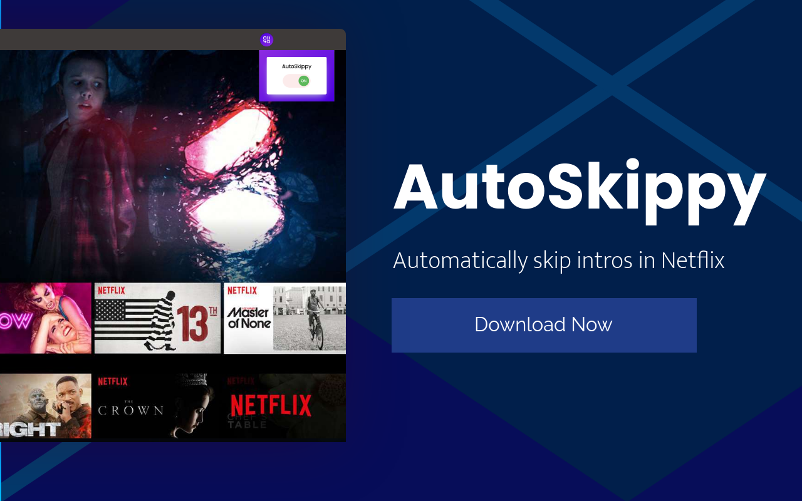

# AutoSkippy Chrome Extension

Welcome to AutoSkippy, your ultimate companion for seamless Netflix binge-watching!

## Why AutoSkippy?

AutoSkippy revolutionizes your Netflix experience by automatically skipping intros for you. No more repetitive clicking—just toggle it on and enjoy uninterrupted streaming!

## Features

- **Automatic Intros Skip**: Say goodbye to intro screens with just a click.
- **Stylish Design**: Sleek toggle button with interactive indicators.
- **Accessibility**: Perfect for everyone, especially those who prefer a hands-free experience.
- **Privacy First**: Your data stays private, AutoSkippy operates securely within Netflix.

## Installation

AutoSkippy is currently pending review on the Chrome Web Store. Once approved, you'll be able to install it directly from the store.

## How to Use

1. Toggle AutoSkippy on.
2. Open Netflix and start watching your favorite shows.
3. Sit back and relax—AutoSkippy takes care of the intros for you!

## Screenshots

## Feedback

We'd love to hear from you! Found a bug or have a suggestion? [Let us know here](link-to-issue-tracker).

---

**Note:** AutoSkippy enhances accessibility by automating repetitive tasks, making Netflix even more enjoyable for everyone!
